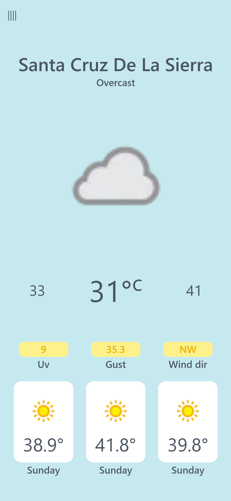
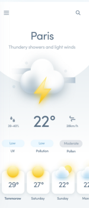

# React Weather 
A simple weather app built with React and Taildwindcss

# Inspiration
I wanted to test and see how difficult it would be to implement a Diana Malewicz, all user experience credits go to her.
(YET THE PROJECT HAS TO BE FINISHED)

The app architecture/structure is mostly based on ideas I've seen in the uxdesign page. You can read more about it on their web site: https://uxdesign.cc/create-a-weather-app-ui-with-3d-like-illustrations-4a6a5686c5ea.  

# Development stack
+ I used and Visual Studio Code
+ [REACT](http://reactjs.org/) was enabled to catch typing errors in React Native JavaScript code
+ [Taildwindcss](https://tailwindcss.com/) for styles 
+ I used git for version control, and stored progress on GitHub.
+ Currently only tested on an android device

# API
+ Weather data is retrieved from http://weatherapi.com/

# Note about API data
The weather data retrived from Open Weather is not very accurate. Most of the time, the weather forecast is not correct.
The most reliable Australian weather data is hosted by Australian Bureau of Meteorology, however it is not very API friendly.  


# Progress and final design  

 React Weather | Design UX
-------------- | --------------
 | 

# Running

## Clone & install

+ Clone this repo `git clone git@github.com:Jalx1000/weatherApp-react-vite.git`
+ `cd weatherApp-react-vite`
+ run `npm install`
+ run `npm run dev`

## Public API keys 
+ Get your API key from https://www.weatherapi.com/my/
+ Create a new file `.env.local`:
```jsx
VITE_APP_KEY= 'YOUR_KEY_HERE'
VITE_APP_URL=http://api.weatherapi.com/v1/forecast.json?aqi=no
```
# Feedback

Feedback is always welcome. Feel free to contact me, I would love to know if you notice something that can be done better. Please be nice, this is my first React Weather app.